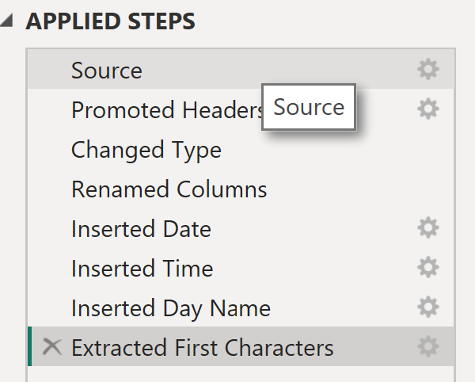
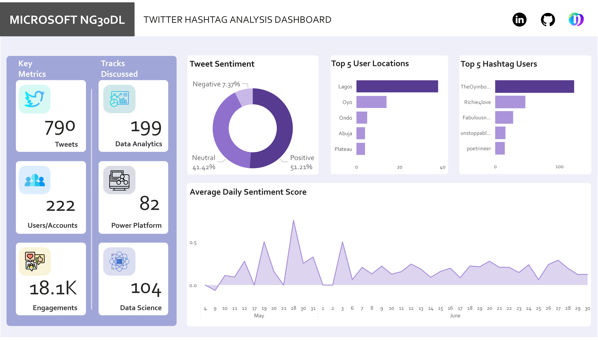

# Project 2 - Twitter Analysis
An analysis of the Microsoft twitter hashtags #NG30DaysofLearning & #30DaysofLearning.

## Introduction
In today’s digital age, online learning has become an increasingly popular way to acquire new skills and knowledge. One example of this is Microsoft’s 30 days of learning program, which provides participants with a range of online training modules, videos, and other learning resources to develop their skills in various Microsoft technologies and products.  

Social media platforms like Twitter have become a vital tool for event organizers to promote and engage with their audience. Hashtags, in particular, have become a popular way for event attendees and participants to share their thoughts, experiences, and feedback in real-time.  

In this analysis, we will examine data that was collected from the event’s hashtag (#30DaysofLearning & #NG30DaysofLearning) on Twitter.

## Problem Statement
The challenge here is evaluating the program’s effectiveness in empowering individuals in Nigeria with digital skills. Without a comprehensive analysis of key themes, sentiment, and engagement, it is difficult to identify areas for improvement and provide insights for future iterations. Therefore, an in-depth analysis of the Twitter hashtag was conducted to evaluate the program’s impact and identify opportunities for enhancing its effectiveness.  

The analysis will be guided by the following research questions:

* What was the overall sentiment expressed on Twitter about the program? Were there any changes in sentiment over time?
* Which geographic location had the most Twitter users using the 30DL hashtag?
* What was the level of engagement and participation of Twitter users in the conversation about the program? How many retweets, likes, and replies did tweets containing the 30DL hashtag receive?
* What were the most common themes and topics of conversation around the program on Twitter?  

Answering these research questions will provide insights into the online conversation around the Microsoft 30 Days of Learning program and help to identify opportunities for improving the program’s impact and reach.

## Data Wrangling
To begin with, the snscrape library was installed and imported in Python, along with other required libraries.

```
# installing snscrape
!pip install --upgrade snscrape

# importing needed libraries
import pandas as pd
import snscrape.modules.twitter as sntwitter
from textblob import TextBlob
```

The Twitter module of snscrape was utilized to query and scrape tweet data from May 1 to July 1, which was then stored in a dataframe.

```
# scrape using snscrape
query = "(#30DaysOfLearning OR #NG30DaysOfLearning) until:2022-07-01 since:2022-05-01"
tweets = []
limit = 30000


for tweet in sntwitter.TwitterHashtagScraper(query).get_items():
    
    if len(tweets) == limit:
        break
    else:
        tweets.append([tweet.date, tweet.url, tweet.user.username, tweet.sourceLabel, tweet.user.location, tweet.content, 
                       tweet.likeCount, tweet.retweetCount,  tweet.quoteCount, tweet.replyCount])
                       
data = pd.DataFrame(tweets, columns=['Date', 'TweetURL','User', 'Source', 'Location', 'Tweet', 'Likes_Count','Retweet_Count', 
                                   'Quote_Count', 'Reply_Count'])
``` 

The Textblob library, built on top of the Natural Language Toolkit, was used to extract sentiments from individual tweets. It is a library that provides an easy-to-use interface for common natural language processing tasks such as the sentiment analysis we would be conducting.

```
# defining a function to perform sentiment analysis on a single tweet
def analyze(tweet):
    blob = TextBlob(tweet)
    return blob.sentiment.polarity

# applying the analyze function to each tweet in the dataframe and store the results in a new column
data['sentiment_score'] = data['Tweet'].apply(analyze)
```

The resulting dataframe was then written to a CSV file to facilitate further analysis.

```
data.to_csv('30DLTweets.csv')
```

The file was loaded into Power Query for transformation, with minor cleaning tasks such as header promotion, column data type changes, and column renaming completed.  

Values in the location field were also standardized, and dates were extracted from the combined datetime field to aid in analysis. Additionally, some columns were created, day column from dates and a day-number column for ease of sorting.


<br/>

Overall, the data wrangling process was completed using Python and various libraries to scrape and analyze Twitter data. The resulting cleaned and transformed data was then loaded into Power BI for further analysis and visualization.

### Analysis/Insights
* Only a small percentage of tweets (7.37%) had a negative sentiment, indicating that while the negative feedback is limited, there may be specific areas of the program that need improvement to meet the expectations of participants.

* In terms of participation, the North-East, North-West, South-East, and South-South geopolitical zones, were underrepresented. The program had higher engagement and popularity in the Southwestern region.

* In total, all 790 tweets containing the 30DL hashtags received a total of 3.3k retweets, 13.9k likes, and 999 replies, which indicates a high level of engagement and interest on Twitter especially for the first iteration of the program.

* In the cohort, three learning tracks were offered by the program. Among these, Data Analytics had the highest number of mentions (199), followed by Data Science and ML (104) and Power Platform (82).

---
  
An interactive version of the dashboard is available at this [link](https://www.novypro.com/project/twitter-hashtag-analysis-remake) for enhanced user experience.

---

## Recommendations
Based on the analysis of tweet hashtags of the Microsoft 30 Days of Learning program, the following recommendations are suggested:

* Increasing awareness to underrepresented zones with targeted advertising campaigns or the use of influencers so as to reach a wider audience.
* Addressing the concerns raised in the negative tweets and making necessary changes to address those issues.
* Soliciting feedback and suggestions from participants to identify areas for improvement and make the necessary changes.
* Partnering/collaborating with local organizations like universities who can help to spread the word about the program to their members and students, which can increase awareness and participation.
* Continued promotion of the benefits and potential career opportunities in these fields (especially power platform) by the organizers.
* Offering localized content including offering courses in local languages to help draw in some zones.
* Focusing on the aspects of the program that received positive feedback and promoting those areas more.

---

Full article on [medium.](https://medium.com/@seyi_/project-2-1-twitter-hashtag-analysis-21c088270f56)
